# Снимки на екраните

Commit `e691660` (`claude/charming-rubin-3lzor2`), генерирани от `ScreenshotTest` (Robolectric, примерни данни).

### 01-home-light.png

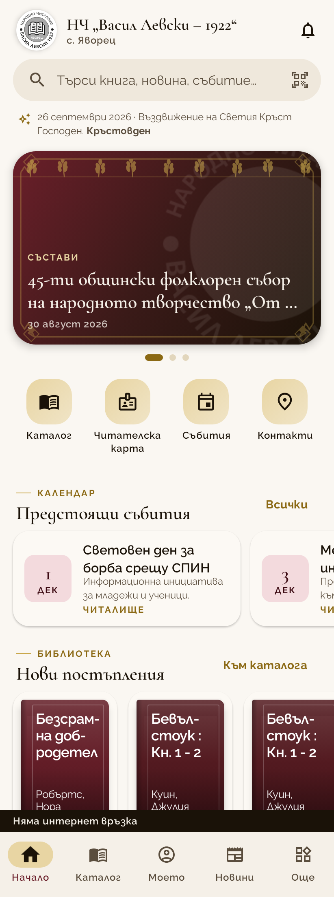

### 02-home-dark.png

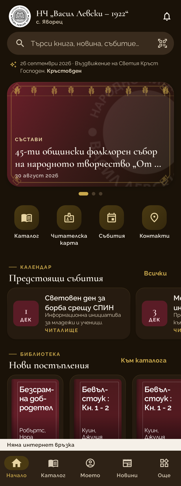

### 03-catalog.png

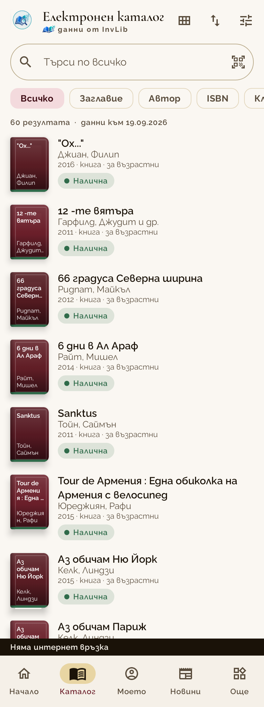

### 04-my.png

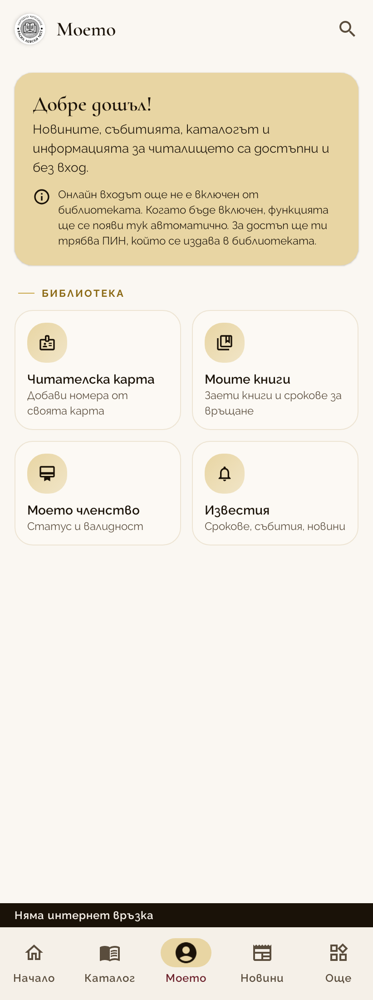

### 05-more.png

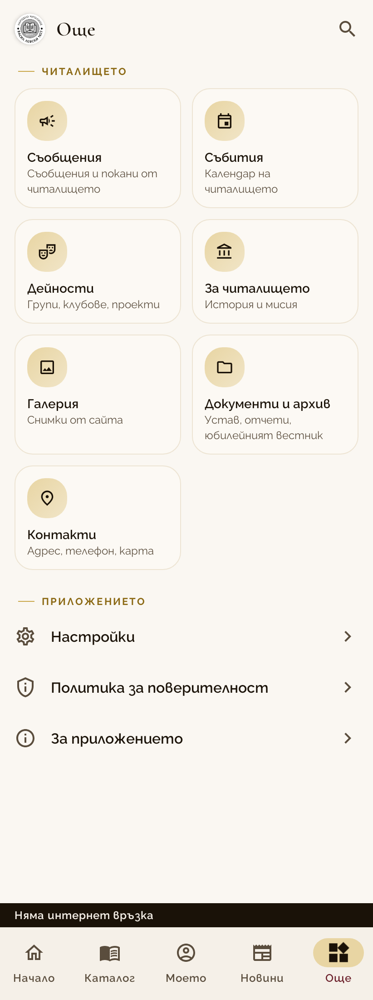

### 06-messages-empty.png

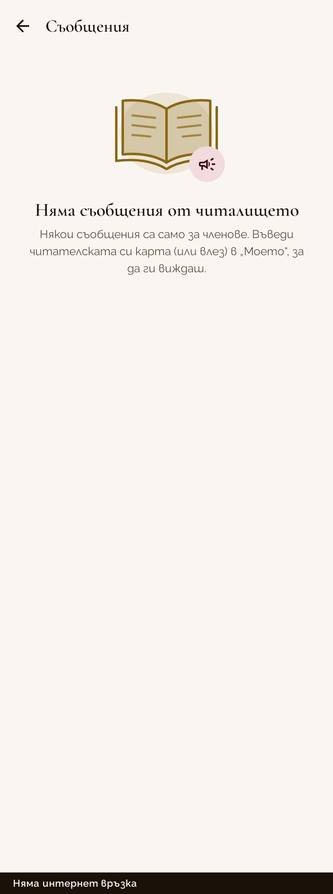

### 07-onboarding.png

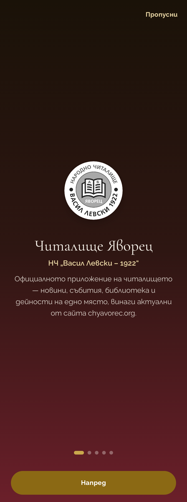

### play-01-home-light.png

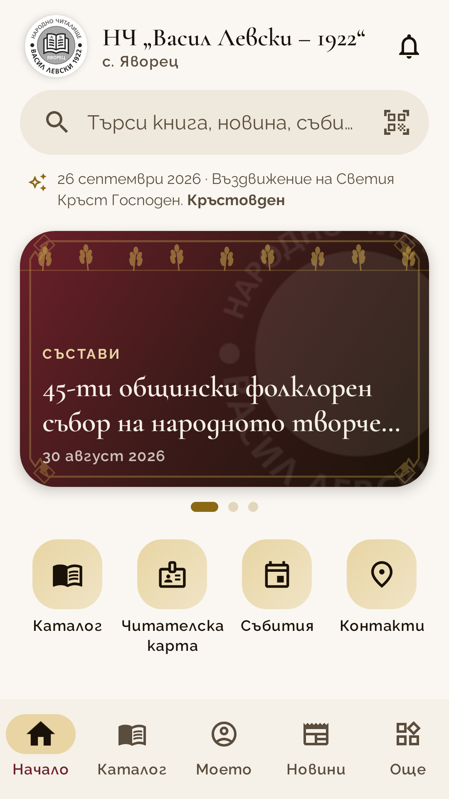

### play-02-home-dark.png

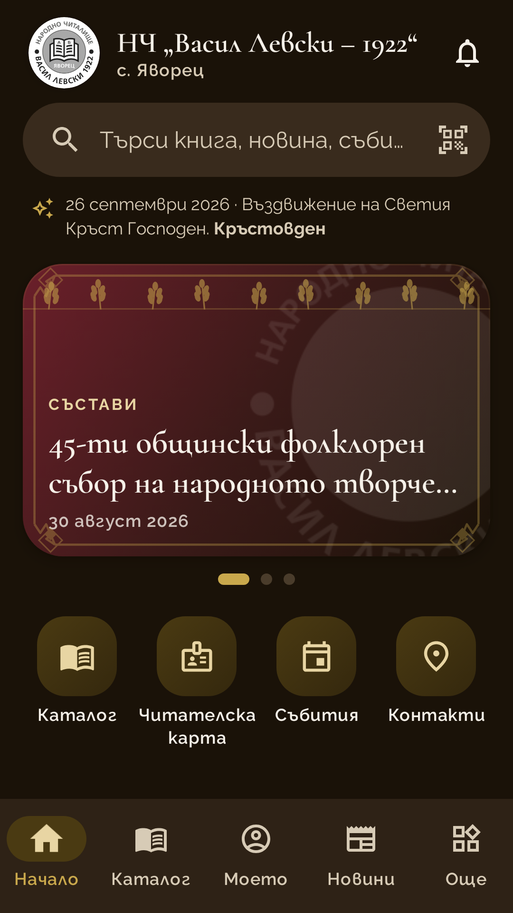

### play-03-catalog.png

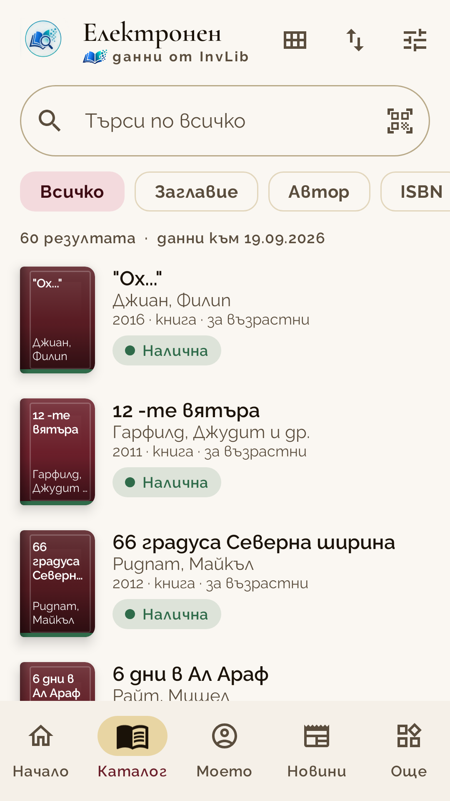

### play-04-my.png

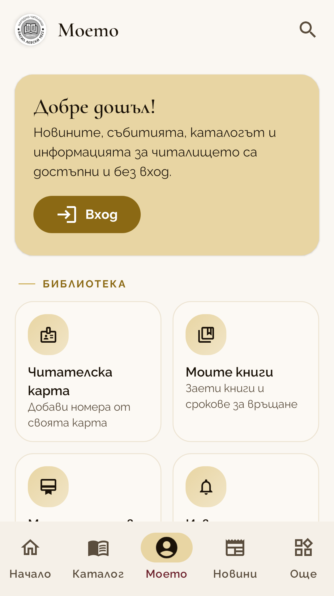

### play-05-more.png

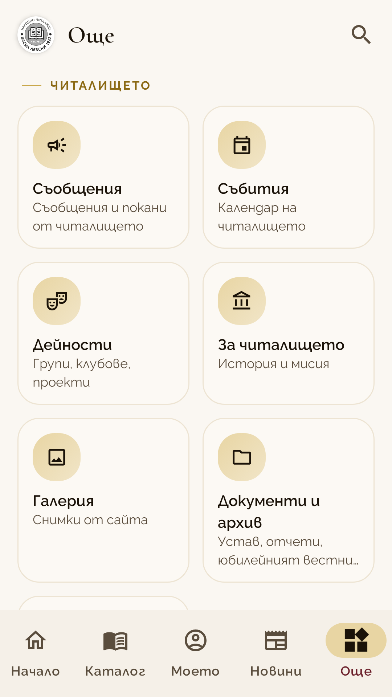

